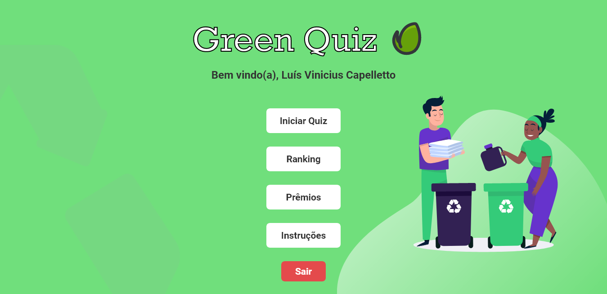

<div align="center">
  
  <h4>:brazil: Quiz web application with an ecological and sustainability theme.</h4>
  <h3>
    <a href="https://green-quiz.vercel.app/" target="_blank">♻ Green Quiz</a> <br>
  </h3>
  <p align="center">
    
    
    
  </p>

  
</div>

#### :brazil: Language: (pt_br) brazilian portuguese

## Running locally

### Firebase configuration

First, you need to create a new firebase project. Then create a `.env.local` file in the project root, and define your env variables with your firebase project configuration values:

```javascript
# Firebase
NEXT_PUBLIC_API_KEY="apiKey"
NEXT_PUBLIC_AUTH_DOMAIN="authDomain"
NEXT_PUBLIC_DATABASE_URL="databaseURL"
NEXT_PUBLIC_PROJECT_ID="projectId"
STORAGE_BUCKET="storageBucket"
MESSAGING_SENDER_ID="messagingSenderId"
APP_ID="appId"
```

Then you need to create a database in firestore and a collection named users. After that you are all set!

## Installation

In the project root, install the dependencies with `yarn` or `npm install`:

```bash
yarn
# or with npm
npm i
```

Run in dev mode in https://localhost:3000

```bash
yarn dev
```

## Features

- Random questions
- Random choices
- Timer
- Ranking

## 🔖 Layout

Você pode visualizar o layout do projeto através [desse link][figma_layout]. É necessário ter conta no [Figma](https://figma.com) para acessá-lo.

## Technologies

- [NextJS][next]
- [Typescript][typescript]
- [Firebase][firebase]
- [Nookies][nookies]
- [Sass][sass]
- [NProgress bar][nprogress]
- [React Toastify][toastify]
- [React Loader Spinner][react_loader]
- [React Countdown Circle Timer][react_timer]

## :memo: Licença

This project is under the MIT license. See the file [LICENSE](.github/LICENSE) for more details.

[sass]: https://sass-lang.com
[next]: https://nextjs.org/docs
[firebase]: https://firebase.google.com
[typescript]: https://www.typescriptlang.org
[nookies]: https://www.npmjs.com/package/nookies
[react_timer]: https://www.npmjs.com/package/react-countdown-circle-timer
[react_loader]: https://www.npmjs.com/package/react-loader-spinner
[nprogress]: https://www.npmjs.com/package/nprogress
[toastify]: https://www.npmjs.com/package/react-toastify
[figma_layout]: https://www.figma.com/file/3C9xWVoZws4U0d3qu4jhGb/GreenQuiz
